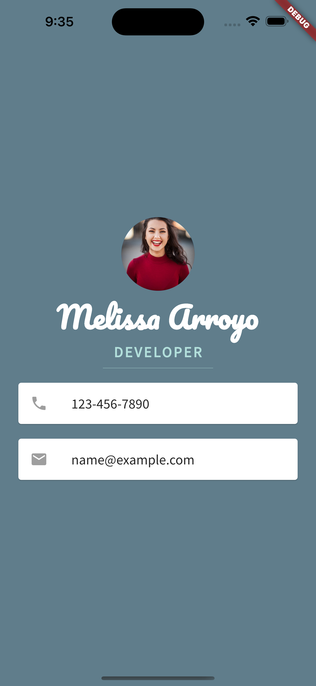

# Mi Card Flutter

A personal business card app created using Flutter. This project showcases a simple and elegant design for displaying contact information, social media handles, and more. It is a great starting point for beginners who want to explore and learn Flutter while building a visually appealing app.

## Features

- Customizable design elements, such as colors, fonts, and images
- Responsive layout, adapting to different screen sizes
- Lightweight and efficient app performance
- Cross-platform support for Android and iOS

## Getting Started

These instructions will help you set up and run the project on your local machine.

### Prerequisites

- Install [Flutter](https://flutter.dev/docs/get-started/install) and set up the environment
- Install [Android Studio](https://developer.android.com/studio) or [VS Code](https://code.visualstudio.com/) with the Flutter and Dart plugins

### Running the Project

1. Clone the repository:
git clone https://github.com/MelissaAT/mi_card_flutter-master.git

2. Navigate to the project directory:

cd mi_card_flutter-master

3. Get the required dependencies:

flutter pub get

4. Run the app on an emulator or a connected device:

flutter run

## Customizing the App

To personalize your business card, edit the `lib/main.dart` file:

- Replace the `assets/images/avatar.png` with your own image
- Modify the text content to reflect your personal information
- Customize the colors, fonts, and other design elements as desired

# Acknowledgements

This project was created as part of the [Complete Flutter Development Bootcamp](https://www.udemy.com/course/flutter-bootcamp-with-dart/) course on Udemy, taught by Angela Yu. I highly recommend this course to anyone interested in learning Flutter and mobile app development.
